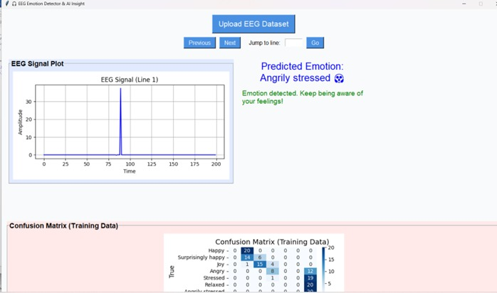

# EEG-Based-Emotion-Detection
Using LLM's and Transformer Models

# 🧠 EEG-Based Emotion Detection using LLM's and Transformers

This project is an AI-powered application that detects human emotions from EEG signal plots using a Transformer-based deep learning model. It includes a GUI for uploading EEG images, visualizing the extracted signal, and displaying the predicted emotion along with an emoji.

---

## 📸 Demo

  
*A sample EEG waveform with the predicted emotion.*

---

## 🚀 Features

- Upload EEG signal images (`.png`, `.jpg`)
- Extract EEG waveforms using image processing (OpenCV)
- Emotion prediction using a Transformer-based model (PyTorch)
- Real-time waveform display in a GUI (Tkinter)
- Emotion output shown with relevant emoji
- Supports the following emotions:
  - Happy
  - Sad
  - Joy
  - Angry
  - Stressed
  - Relaxed
  - Fear

---

## 🎯 Emotion Labels

| Label | Emotion   | Emoji |
|-------|-----------|-------|
| 0     | Happy     | 😄    |
| 1     | Sad       | 😢    |
| 2     | Joy       | 😍    |
| 3     | Angry     | 😠    |
| 4     | Stressed  | 😣    |
| 5     | Relaxed   | 😌    |
| 6     | Fear      | 😱    |

---

## 🛠️ Installation

1. **Clone the repository**

```bash
git clone https://github.com/Saha-na16/EEG-Emotion-Detection.git
cd EEG-Emotion-Detection
